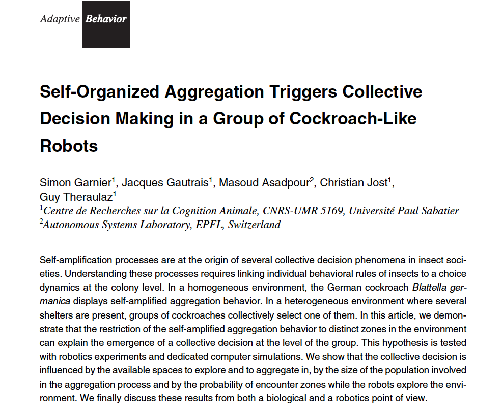
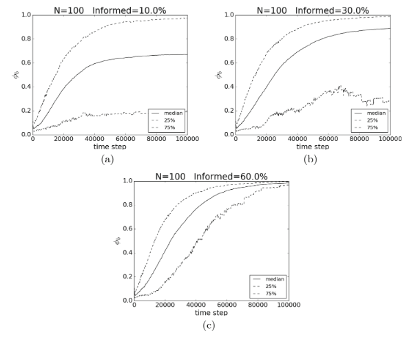
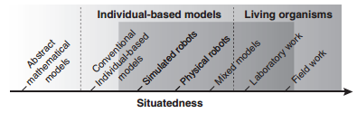
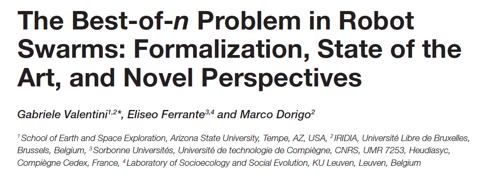

# Self-organized papers

## 1.

### Goals

Investigate a self-organized decision-making process from both a mechanic and biological perspective.

Prove cockroaches aggregation behavioral model in robots:
  - The larger the number of staying neighbors, the more likely the animal is to stop and stay beside them.

- Test how collective decision mechanism deals with physically distint oportunities:  
    - How does collective choice scale with group size and changing available space for aggregation?
    - How do differences between the sizes of the two shelters bias collective choice?

**Baseline**: Any constraint that modulates the speed of the self-amplification process at one of the different opportunities can lead that opportunity to win or lose against others.

----------------------------------

#### Behavioral model

- Modulation of staying time depends on the local perception of proximate neighbors.

Rules:  
- Random walk
- Number or percieved neighbors modulates probability of:
  - Stop inside a shelter
  - Duration of stop
  - Restart motion.

**Hypotesis**

If aggregation is restricted or favored in spatially distinct areas, competition should arise between the potential aggregation sites.

-----------------------

#### Experiment

Physical robots:
-  Alice
- 10 individuals

Simulations:  

Settings:
1. Two identical shelters

2. Different radius shelters
  - Big - small
  - Big - medium

  -------------------

### RESULTS

- The collective is able to sense and comapre the size of the shelters during the collectiv decision process.
- Performance not implemented directly in to individual robots.

**A physical property of the environment can also have an influence through the collective dynamics and without any modulation of the individual behavior**

--------------------
### FUTURE WORK

- Larger grups aggregation based on individual density-estimations.
- Counting the number of contacts with other robots encountered while exploring the shelter: the rate of encounters under is likely to grow with the density of robots under this shelter.

- Biological system: ant *Temnothorax albipennis*(Prat 2005).

----------------------------------------

## 3. Self-Organized Aggregations in Swarms of Robots with Informed Robots

### Goals

Study how the introduction of informed robots i.e.(with a preferred aggregation site) impacts the aggregation dynamics.

------------------------------

### Experimental conditions

- SIMULATIONS

- Two physically identical shelters, except for their color.

- Informed individuals only stop in preferred shelter (black) and ignore the other (white)

- Proportion of informed robots and group size varied

- Density kept constant

---------------------------

### Results

- Symmetry breaking towards preferred shelter of informed individuals.

- Non-linear increase of proportion of robots aggregated in black shelter.
    - The slope gets steeper as proportion of informed individuals increases.

-------------------------------------

## 2. Fundamental Collective Behaviors in Swarm Robotics

###**1. Designing Swarm Behaviours**

**Characteristics:**

- Parallelism
- Scalability
- Robustness
- Flexibility
- Adaptability to unknown conditions
- Decentralization of control: local interactions.
- Limited individual abilities
- Lack of global knowledge.
- Self-organization

--------------------------

**Starting points**

- Biological systems.
- Not constrained to mimicking nature.

**Challenges of design**

*AGGREGATION*: Precondition for collective behavior.

*Keep coherent organization*: synchronization and coordinated motion.

*Search together and process items of environment*

*Necessity to behave as a single whole*: collective perception and collective decision mechanisms.

-----------------

###**2. Getting together: Aggregation**

From a ~ uniform distribution of agents in space, the system converges to a varied distribution with recognizable aggregates.

#### 2.1. Variants of Aggregation Behavior

**a) Heterogeneities in the environment:**
- Light, humitiy, corners, shelters...
- Interactions between differerent agents are not exploited.

**b) Heterogeneities im agents' behavior:**

- Environment heterogeneities are not present
- Self-organization based on positive feedback mechanism.
- Agents are sources of small heterogeneity in the environment.
- The more aggregated agents, the higher the probability to be attracted by the signal.
- Amplification of small heterogeneities: larg aggregates.

-----------------------

#### 2.3. Self-Organized Aggregation in Biological Systems
@span DIVIDIR EN DOS
**Two main aggregation processes**

1. Signal-intensity based

- Agents emmit signal that creates an intensity gradient.
- Agents move in the direction of higher intensity.

2. Stopping time in response to social cues.

- Agents with probability to stop for some time.
- Number of neighbors increases probability of stopping or remaining within the aggregate.
- Aggregation mediated by social influences.

**GENERAL PROPERTY**
Two probabilities:
- Probability to enter an aggregate: increases with size.
- Probability to leave an aggregate: decreases accordingly.
Positive feedback loop.

--------------------------

#### 2.4. Self-Organized Aggregation in Swarm Robotics

***Two behavioral models***

**1. Probabilistic approach**

- Probability of joining, staying and leaving an aggregate, depending on number of perceived neighbors.

- Distilling relevant mechanismos that produce a self-organizing behavior.

*STUDIES*   

Garnier et al. 2008
- Replication of aggregation in cockroaches.
- Alice robot

2. Artificial evolution

- Not dependent on probability of joining/leaving an aggregate: robots never quit an agregate.

- Attractive and repulsive forces.

- The aggregate
 continuously expand and shrink, moving: recluting robots or smaller aggregates on the way.

 - Aggregates are dynamic structures capable of moving.

*STUDIES*

Dorigo et al. 2004.
Evolving self-organizing behaviors for a swarm-bot.

----------------------------------------------

## 3. Using robots to understand social behaviour

### Introduction

#### Spectrum of study

**Physical robots**  

Fewer assumptions need to be made regarding the environmental properties.  

Laws of physics are included for free in robotic models.

Unexpected outcomes due to inclusion of a physical property that would not have been included in an abstract environment.

#### Understanding of social behaviour  

**Questions adressed**

¿How individuals coordinate their efforts to achieve a common goal?  

- Efficient self-organization processes can occur even with little sensory information.

- Division of labor can take place simply due to differences in local perception, in the absence of inter-individual differences and individual recognition.

- Self-organization can even happen withouth any communication or memory.

¿How social behavior evolves?

¿How communicative behaviour evolves?

---------------------------

#### Evaluating robotic models

- Biology does not integrate robotic models.

¿Why?

1. Many robotic studies do not use a **hypothesis driven** approach.

In biology, work consists of experiments designed to test a specific hypothesis.

Robot models have been mostly **exploratory**: explore if inclusions of physical properties will reveal novel aspects of the collective behaviour in question.

Risk of not answering a particular question.

In **hypothesis driven** experiments, controlled manipulations make it easier to understand causal mechanisms, and thus to link the model results to natural phenomena.

--------------------------------------

### Future directions

- Role of individual and kin recognition in collective decision-making.

- Interplay between mechanistic properties that are highly dependent on physical factors, and effects arising over evolutionary time:
    - How social interactions can affect the evolutionary pathways of organisms and the evolution of complex social systems.

----------------------------

## Discrete collective decision making proposed taxonomy

### Best-of-n problem

- Swarm of robots to make a collective decision over which option, out of n available options, offers the best alternative to satisfy the current needs of the swarm.

- **Options**: domain-specific concepts related to particular scenarios (e.g. foraging patches, aggregation areas, traveling paths). Options are characterized by a **quality** and a **cost**.   

-------------------
### Option quality

  - Quality of the option, of primary concern for the objective of the swarm.

  - Robots are programmed to actively measure and estimate their quality and to prefer options whose attributes have certain characteristics.

  - E.g. type, quality or availability of food in a foraging patch.

  - Once evaluated, information of the quality of the option is used to influence the collective decision-making process in favor of the best option.

### Option cost

- Average time needed by a robot to obtain one sample of the quality of the option.

- Depends on the target scenario, and **robots are not requiered to perform measurements to evaluate it**.

- The cost biases the collective decision-making process indirectly: bias induced by the environment and is not under the control of individual robots.

--------------------------------

### Classification of the best-of-n problem instances:

- Five categories depending on who the option **quality** and **cost** are configured in he application scenario and perceived by the robots.

  

-----------------------------------

### Also, quality and cost can be **static** or **dynamic**

  - When static, designers favor collective decision-making strategies that result in consensus decisions.

  - When dynamic, i.e. a function of time, designers favor strategies that result in a large majority of robots in the swarm favoring the same option without converging to consensus.
  - In dynamic, remaining majority of agents that are no aligned with the current collective decision keep exploring other options, and possibly discover new ones, making the swarm adaptive.

- Additionally, a consensus decision corresponding to a large majority rather than unanimity allows swarm systems to swiftly react to perturbations as in the case of fish schools.

-------------------------------------

### Classification based on the design

Brambilla et al. 2013 classified by:   

1. robots works on a certain task
2. how it interacts with its neighbor robots
3. how it interacts with the environment.

In this paper, classification of experiments based by design:

---------------------
### 1. Bottom-up design

**1.1. Opinion-based approaches**

Robots have an explicit internal representation of their favored opinion.

Role of designer is to define the control rules that determine how robots exchange opinions and how they change their own opinion.   

Advantage: generic strategies that can be applied to different application scenarios.

**1.2. Ad-hoc approaches**

Control rules governing interaction between robots were designed to address a specific task.

Strategies not explicitly designed to solve a consensus achivement problem, but the execution results in collective decision.

Studies that focus on problem of spatial aggregation and on the problem of navigation of unknown environments.

---------------------------

### 2. Top-down design

Robot controller is derived automatically from a high-level description of the desired swarm behavior.

**2.1. Evolutionary robotics**

Evolutionary computation to obtain a neural network representing the robot controller.

Black-box controllers.

**2.2. Automatic modular design**

Relies on optimization processes to combine behaviors chosen from a predefined set and obtain a robot controller that is represented by a probabilistic finite-state machine. 
